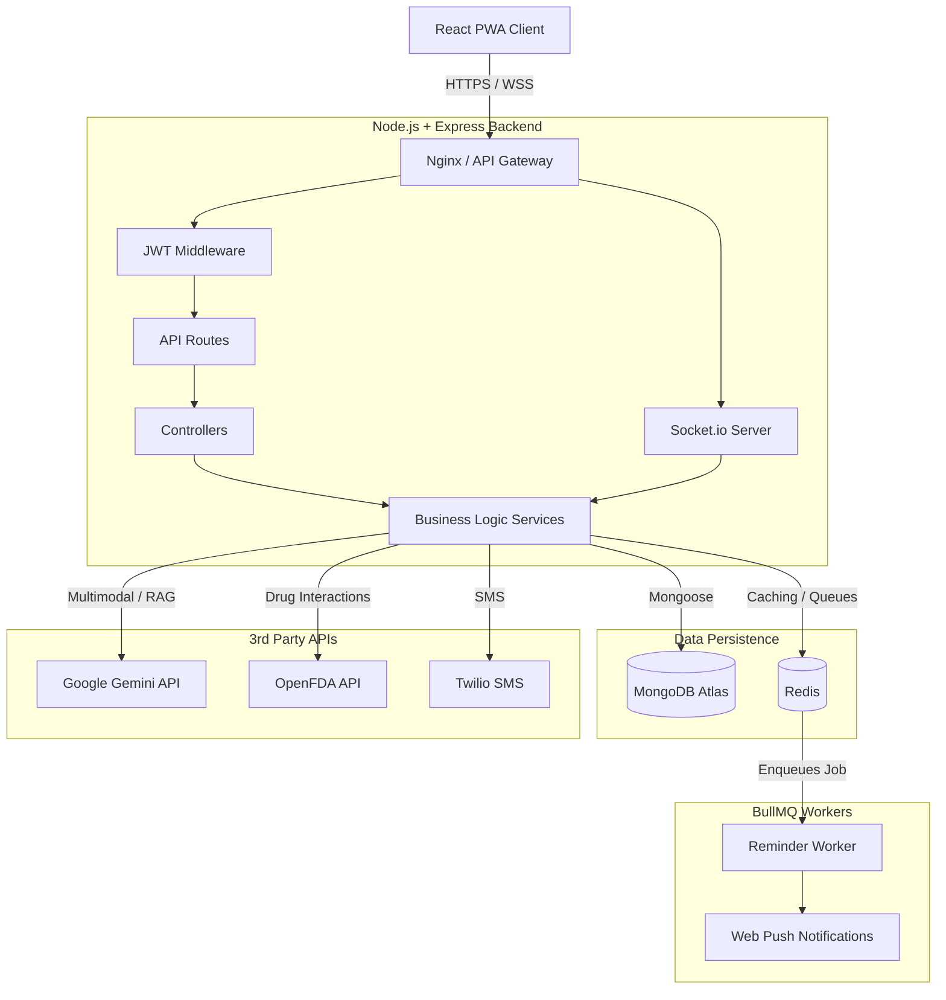

# MediSync-AI Architecture & System Design

## 1. High-Level Architecture
MediSync-AI is a distributed, offline-capable MERN stack application augmented with real-time web sockets and background job processing.

## 2. Architecture Decision Records (ADRs)

### ADR 1: BullMQ + Redis vs Node-Cron
- **Decision**: Used BullMQ and Redis for medication reminders.
- **Why**: Node-cron runs in-memory. If the Node server crashes or restarts, all pending scheduled cron jobs are lost. BullMQ persists jobs in Redis, guaranteeing at-least-once execution and allowing horizontal scaling of worker nodes.
- **Trade-offs**: Introduces Redis as an additional infrastructure dependency.

### ADR 2: Progressive Web App (PWA) vs React Native
- **Decision**: Built the frontend as an installable PWA.
- **Why**: Allows offline capability (via Service Workers caching) and native push notifications without the overhead of maintaining separate iOS and Android codebases or dealing with App Store approvals.
- **Trade-offs**: iOS push notifications require iOS 16.4+ and manual "Add to Home Screen" actions.

### ADR 3: Gemini Vision vs Traditional OCR Libraries (Tesseract)
- **Decision**: Utilized Google Gemini Flash 2.5 for parsing prescriptions.
- **Why**: Medical prescriptions have highly variable, unstructured layouts and handwriting. Traditional OCR (like Tesseract) fails to understand semantic context (e.g., distinguishing "Take 2" from "Refills: 2"). Gemini extracts structured JSON reliably.
- **Trade-offs**: Higher latency (1.5s - 3s) compared to local OCR, and strict reliance on internet connectivity.

### ADR 4: Socket.io vs Long-Polling
- **Decision**: Used WebSockets via Socket.io for the Caregiver Dashboard.
- **Why**: Provides true real-time synchronization when a patient logs a dose without spamming the backend with HTTP polling requests every 5 seconds.
- **Trade-offs**: Requires sticky sessions on the load balancer when horizontally scaling the Node backend.

## 3. Scaling Strategy (100,000+ Users)
To scale this architecture to enterprise levels:
1. **Horizontal Backend Scaling**: Deploy the Node backend across multiple containers (e.g., Kubernetes or AWS ECS) behind an Application Load Balancer.
2. **Redis Cluster**: Move from a single Redis instance to a managed Redis Cluster (AWS ElastiCache) to handle high-throughput BullMQ jobs.
3. **MongoDB Sharding**: Index heavily queried fields (`user_id`, `actionTime`) and introduce sharding based on geographical tenant IDs.
4. **Dedicated Worker Nodes**: Separate the API backend from the BullMQ worker backend. Have dedicated worker containers whose solely job is processing reminders to prevent CPU blocking on the main API.

## 4. Security Implementation
- **Authentication**: JWT-based stateless authentication with `httpOnly` fallback considerations.
- **Password Security**: bcrypt hashing with a salt factor of 10.
- **Input Validation**: Mongoose schema validation.
- **Secrets Management**: Environment variables via `.env`.
- **CORS**: Restricted origins to the exact frontend domain.
