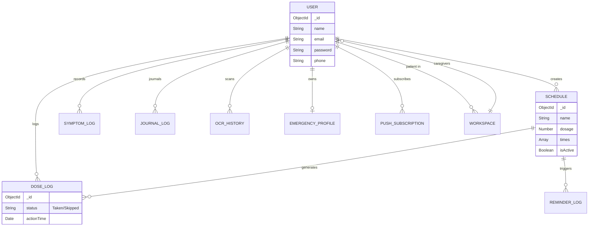

# MediSync-AI Database Schema & Relationships

## 1. ER Diagram

## 2. Document Collections
- **Users**: Core authentication collection.
- **Schedules**: Holds active and inactive medication schedules.
- **DoseLogs**: The single source of truth for adherence metrics.
- **SymptomLogs**: Tracks adverse reactions with 1-10 severity.
- **JournalLogs**: Voice transcriptions and NLP extracted tags.
- **EmergencyProfiles**: Securely hashed medical data for first responders.
- **Workspaces**: Connects Caregivers to Patients (RBAC mapping).
- **TokenBlocklist**: Invalidates JWTs on logout.
- **ReminderLogs**: Tracks execution of BullMQ jobs to prevent duplicate pushes.
- **PushSubscriptions**: Stores VAPID keys for PWA notifications.
- **OCRHistory**: Keeps raw texts and Gemini parses for audit purposes.

## 3. Indexing Strategy
- `email` in **Users**: Unique Index.
- `hash` in **EmergencyProfiles**: Unique Index for O(1) public lookups.
- `user` + `actionTime` in **DoseLogs**: Compound index for fast time-series heatmap queries.
- `token` in **TokenBlocklist**: TTL Index (expires automatically after 7 days).
